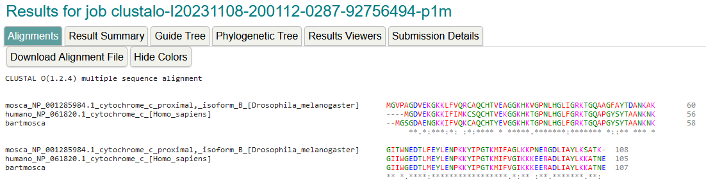
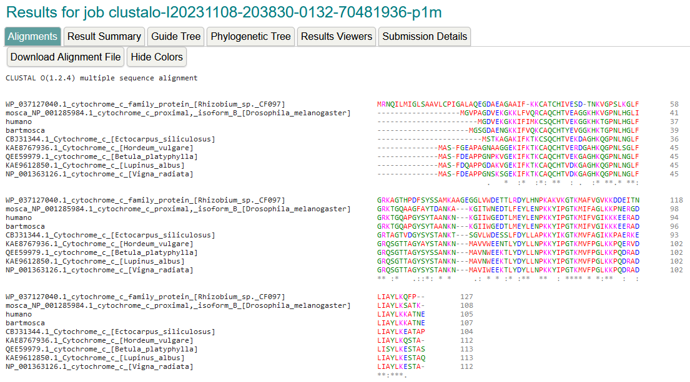

# Bioinformática - TP5: Inferencias Evolutivas

## Desafío 1

El alineamiento de secuencias de proteínas en común nos puede ayudar en la comparación.
Para saber a qué organismo de parece más el Moscahumano se podría utilizar el puntaje del alineamiento de las secuencias.
Utilizar más secuencias en el análisis incrementaría la confiabilidad con la cual se pueden inferir resultados, en este caso sería saber con mayor exactitud a qué organismo es se asemeja más el Moscahumano, si a la Mosca o al Humano.

## Desafío 2

## Desafío 3

## Desafío 4

Los modelos de sustitución se utilizan para estimar la probabilidad de observar los datos de secuencia dados bajo diferentes escenarios evolutivos, lo cual es un componente fundamental de la construcción de árboles filogenéticos.
El "Bootstrap" es una técnica utilizada para evaluar la confiabilidad de las ramas en un árbol filogenético. El Bootstrap se basa en el concepto de remuestreo y se usa para estimar la robustez de las agrupaciones filogenéticas en un árbol, es decir, cuán seguras o confiables son esas agrupaciones.
Un mayor número de "Bootstraps" tiende a proporcionar estimaciones más precisas y confiables de la robustez del árbol filogenético, pero también puede aumentar significativamente el tiempo de cálculo.
